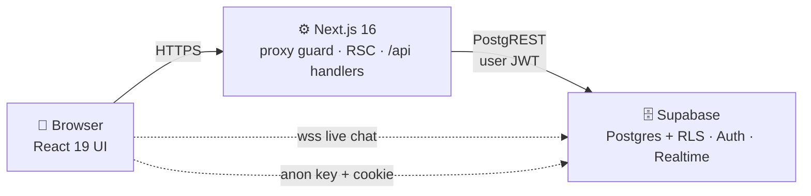

# 🧠 MindCircle

A safe, anonymous mental-wellness companion for students and young professionals. Journal your thoughts, track your mood, connect with peers in moderated rooms, and find professional help — all in one warm, private space.

> **Built with privacy at the core:** every personal entry is owner-only at the database level, and community features default to anonymous aliases like `quiet-sparrow-42`.

---

## ✨ Features

| Feature | What it does |
|---|---|
| 📓 **Private Journaling** | Write entries with optional mood tags. Owner-only access enforced by Row Level Security. |
| 📈 **Mood Tracking** | Emoji-based daily check-ins with insights: averages, distribution, best day, streaks, and trend takeaways. |
| 👥 **Peer Support** | Anonymous chat rooms with live messaging, plus one-to-one DMs with read receipts. |
| 🌸 **Community Stories** | Share anonymous 24-hour stories and react with likes. |
| 🎯 **Guided Activities** | Breathing exercises, grounding techniques, and mindfulness practices. |
| 🩺 **Counsellor Directory** | Browse verified counsellor profiles. |
| ❤️ **Crisis Support** | One-tap access to 24/7 Indian helplines (iCall, Vandrevala, AASRA) plus an interactive breathing exercise. |
| 👤 **Anonymous Identity** | Stable alias + emoji avatar derived from your ID — your real identity is never shown in community spaces. |

## 🛠 Tech Stack

| Layer | Technology |
|---|---|
| Framework | [Next.js 16](https://nextjs.org) (App Router, React Server Components) |
| UI | [React 19](https://react.dev), [TypeScript 5](https://www.typescriptlang.org) |
| Styling | [Tailwind CSS v4](https://tailwindcss.com) + [shadcn/ui](https://ui.shadcn.com) (base-nova) + [framer-motion](https://www.framer.com/motion/) |
| Icons | [lucide-react](https://lucide.dev) |
| Database & Auth | [Supabase](https://supabase.com) — PostgreSQL, Auth (email + OTP), Realtime |
| State | React hooks + Route Handlers (no global store needed) |

## 🚀 Getting Started

### Prerequisites

- **Node.js 20+**
- A **Supabase project** (free tier works) — you'll need its URL and anon key

### 1. Install dependencies

```bash
npm install
```

### 2. Configure environment

Create a `.env.local` file in the project root:

```env
NEXT_PUBLIC_SUPABASE_URL=https://<your-project>.supabase.co
NEXT_PUBLIC_SUPABASE_ANON_KEY=<your-anon-key>
```

> Only the public URL and anon key are needed — all data protection is enforced by database-level Row Level Security, so no service-role key is used anywhere in the web app.

### 3. Set up the database

Open the **Supabase SQL Editor** and run the migration scripts **in order** (all are idempotent):

1. `supabase_migration_auth.sql` — profile tables, signup trigger, FK structure
2. `supabase_migration_real_data.sql` — RLS policies, story likes, room data

These create all tables (`users`, `mood_logs`, `journal_entries`, `stories`, `story_likes`, `chat_rooms`, `room_members`, `messages`, `direct_messages`, `matches`) with their security policies.

### 4. Run the dev server

```bash
npm run dev
```

Open [http://localhost:3000](http://localhost:3000) — you'll be greeted by the landing page. Sign up with an email and you're in. 🎉

### Other scripts

```bash
npm run build   # production build
npm run start   # serve the production build
npm run lint    # eslint
node scripts/test-room-flow.mjs   # e2e smoke test (needs dev server running)
```

## 📁 Project Structure

```
src/
├── app/
│   ├── (auth)/               # Landing, login, signup, OTP verify, onboarding
│   ├── app/                  # Authenticated area (guarded by proxy)
│   │   ├── page.tsx          # Dashboard: mood check-in, weekly stats
│   │   ├── journal/          # Private journaling
│   │   ├── connect/          # People + rooms discovery
│   │   ├── chats/[id]/       # Room & DM threads (realtime)
│   │   ├── insights/         # Mood analytics & trends
│   │   ├── activities/       # Guided exercises
│   │   ├── counsellors/      # Counsellor directory
│   │   ├── crisis/           # Helplines + breathing exercise
│   │   ├── story/create/     # Anonymous stories
│   │   └── profile|settings/ # Account management
│   └── api/                  # Route handlers (all auth-checked)
│       ├── me/ mood/ journal/ matches/
│       ├── stories/ (+ /like)
│       └── chat/ (rooms, messages, dms)
├── components/
│   ├── layout/               # AppLayout, SideNav, BottomNav, TopBar
│   └── ui/                   # Button, Card, Modal, EmojiSlider, MoodCheckin…
├── lib/
│   ├── supabase/             # server.ts / client.ts / middleware.ts
│   ├── dates.ts              # Locale-stable formatting (hydration-safe)
│   ├── alias.ts              # Anonymous alias generation
│   ├── counsellors.ts        # Static counsellor directory
│   └── constants.ts          # Nav items, mood emojis, features
├── hooks/                    # useMediaQuery & friends
└── proxy.ts                  # Session guard (Next 16 middleware)
```

## 🏗 Architecture at a Glance



**Every request flows through three security gates:**

1. **Proxy guard** (`src/proxy.ts`) — refreshes the session cookie and redirects guests away from `/app/*`.
2. **Route handler check** — every `/api/*` endpoint re-verifies `auth.getUser()` before touching data.
3. **Row Level Security** — the database itself only lets you read/write your own rows; chat messages require room membership.

📖 **Full architecture docs:** see [`docs/ARCHITECTURE.md`](docs/ARCHITECTURE.md) — includes system diagrams, signup/data-access/realtime workflows, and the complete ER model. An interactive HTML version lives at `docs/architecture.html`.

## 🔒 Privacy & Security Model

- **Anonymous by default** — community spaces show your generated alias, never your email.
- **Owner-only data** — journal entries and mood logs are readable only by you, enforced by Postgres RLS (not just application code).
- **No service keys in the client** — the app uses only the Supabase anon key.
- **Auto-cleanup** — deleting an auth account cascades to all profile data.
- **Crisis-first design** — helplines are one tap away from anywhere in the app.

## 🗺 Roadmap Ideas

- [ ] End-to-end encryption for journal entries
- [ ] AI-assisted mood pattern summaries
- [ ] Counsellor booking & video sessions
- [ ] Push notifications for streaks & check-in reminders
- [ ] Group moderation tools for community rooms

## 🤝 Contributing

1. Create a branch for your change
2. Make your edits — run `npm run lint` and `npx tsc --noEmit` before submitting
3. Keep new UI mobile-first; the app is designed phone-first and scales up to desktop

## 📄 License

Private project — all rights reserved.

---

<p align="center"><em>Made with care for mental wellness. You're not alone. 💜</em></p>
