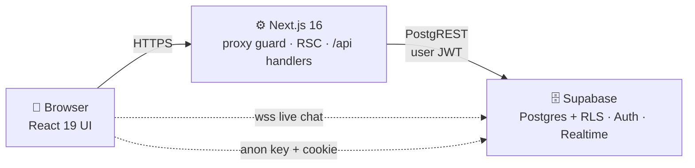

# 🧠 MindCircle

A safe, anonymous mental-wellness companion for students and young professionals. Journal your thoughts, track your mood, connect with peers in moderated rooms, and find professional help — all in one warm, private space.

> **Built with privacy at the core:** every personal entry is owner-only at the database level, and community features default to anonymous aliases like `quiet-sparrow-42`.

---

## ✨ Features

| Feature | What it does |
|---|---|
| 📓 **Private Journaling** | Write entries with optional mood tags. Owner-only access enforced by Row Level Security. |
| 📈 **Mood Tracking** | Emoji-based daily check-ins with insights: averages, distribution, best day, streaks, and trend takeaways. |
| 👥 **Peer Support** | Anonymous chat rooms with live messaging, plus one-to-one DMs with read receipts. Photos can be sent from the camera or the gallery. |
| 🌸 **Community Stories** | Share anonymous 24-hour stories and react with likes. |
| 🎯 **Guided Activities** | Breathing exercises, grounding techniques, and mindfulness practices. |
| 🩺 **Counsellor Directory** | Browse verified counsellor profiles. |
| ❤️ **Crisis Support** | One-tap access to 24/7 Indian helplines (iCall, Vandrevala, AASRA) plus an interactive breathing exercise. |
| 👤 **Community Alias** | A unique, randomly generated handle (`silver-otter`) that is your primary identity everywhere — display names can repeat, aliases cannot. Changeable any time, as long as it stays unique. |
| 🔍 **Discover** | Searchable directory of real members, filterable by interest. Connect, cancel a request, or message people you are already connected with. |
| 🛡️ **Safety Tools** | Block someone (they leave your Discover, chats and search entirely) and report them with a reason. Accounts are removed automatically at 20 reports. |
| 🗂️ **4-Step Profile Setup** | One guided flow for name, location, bio, avatar, interests, goals and profile visibility — reachable again any time from Settings. |

## 🛠 Tech Stack

| Layer | Technology |
|---|---|
| Framework | [Next.js 16](https://nextjs.org) (App Router, React Server Components) |
| UI | [React 19](https://react.dev), [TypeScript 5](https://www.typescriptlang.org) |
| Styling | [Tailwind CSS v4](https://tailwindcss.com) + [shadcn/ui](https://ui.shadcn.com) (base-nova) + [framer-motion](https://www.framer.com/motion/) |
| Icons | [lucide-react](https://lucide.dev) |
| Database & Auth | [Supabase](https://supabase.com) — PostgreSQL, Auth (email + OTP + Google OAuth), Realtime, Storage |
| State | React hooks + Route Handlers (no global store needed) |

## 🚀 Getting Started

### Prerequisites

- **Node.js 20+**
- A **Supabase project** (free tier works) — you'll need its URL and anon key

### 1. Install dependencies

```bash
npm install
```

### 2. Configure environment

Create a `.env.local` file in the project root:

```env
NEXT_PUBLIC_SUPABASE_URL=https://<your-project>.supabase.co
NEXT_PUBLIC_SUPABASE_ANON_KEY=<your-anon-key>
```

> Only the public URL and anon key are needed — all data protection is enforced by database-level Row Level Security, so no service-role key is used anywhere in the web app.

### 3. Set up the database

Open the **Supabase SQL Editor** and run every migration script below **in this order**. All of them are idempotent, so re-running one is safe.

| # | File | What it creates |
|---|---|---|
| 1 | `supabase_migration_auth.sql` | Core tables, signup trigger, foreign keys |
| 2 | `supabase_migration_real_data.sql` | RLS policies, story likes, sample rooms |
| 3 | `supabase_migration_profile_setup.sql` | Makes `public.users` insertable and repairs the signup trigger |
| 4 | `supabase_migration_profiles.sql` | Real profile columns + the `connections` table |
| 5 | `supabase_migration_profile_about.sql` | `personality` and `note` for the About screen |
| 6 | `supabase_migration_safety.sql` | Profile visibility, `blocks`, `reports`, auto-removal |
| 7 | `supabase_migration_chat_media.sql` | Chat image attachments + optional mood sharing |

> **Steps 3 and 4 are the ones people usually miss.** Without step 3 the `users` row for a brand-new account is never created, so `/api/me` returns 500 and the profile-setup flow never appears. If setup does not show up on a new account, run step 3 first.

Tables created across all seven files: `users`, `mood_logs`, `journal_entries`, `stories`, `story_likes`, `chat_rooms`, `room_members`, `messages`, `direct_messages`, `matches`, `connections`, `blocks`, `reports` — each with its Row Level Security policies.

### 4. Optional: Google sign-in

Email/OTP works out of the box. For **Continue with Google**:

1. In Supabase → **Authentication → Providers**, enable **Google** and paste your OAuth client ID and secret.
2. In that same screen, add `http://localhost:3000/auth/callback` to **Redirect URLs** for local development, and your production domain for deployment.
3. In Google Cloud Console, add the same URL as an **Authorized redirect URI**.

### 5. Optional: tidy up old data

If you have been testing the app for a while, orphaned rows may remain from accounts deleted before the cleanup triggers existed. Run `supabase_migration_dm_cleanup.sql` once in the SQL Editor to remove direct messages whose sender or receiver no longer exists. It is safe to re-run.

### 6. Optional: seed demo people

With only one or two accounts, Discover and Chats look empty. You can give the existing test accounts realistic names, bios, interests and goals straight from the SQL editor — update `display_name`, `location`, `bio`, `interests`, `goals`, `personality` and `note` on rows in `public.users`.

### 7. Run the dev server

```bash
npm run dev
```

Open [http://localhost:3000](http://localhost:3000) — you'll be greeted by the landing page. Sign up with an email (or Google) and you're taken straight into the 4-step profile setup. 🎉

### Other scripts

```bash
npm run build   # production build
npm run start   # serve the production build
npm run lint    # eslint
npx tsc --noEmit   # type check without emitting files
node scripts/test-room-flow.mjs   # e2e smoke test (needs dev server running)
```

## 📁 Project Structure

```
src/
├── app/
│   ├── (auth)/               # Landing, login, signup, OTP verify, onboarding
│   ├── app/                  # Authenticated area (guarded by proxy)
│   │   ├── page.tsx          # Dashboard: mood check-in, weekly stats
│   │   ├── journal/          # Private journaling
│   │   ├── connect/          # People + rooms discovery
│   │   ├── discover/         # Searchable member directory
│   │   ├── chats/[id]/       # Room & DM threads (realtime, images)
│   │   ├── profile/[id]/     # Profile, /about and /mood for a connection
│   │   ├── insights/         # Mood analytics & trends
│   │   ├── activities/       # Guided exercises
│   │   ├── counsellors/      # Counsellor directory
│   │   ├── crisis/           # Helplines + breathing exercise
│   │   ├── story/create/     # Anonymous stories
│   │   └── settings/         # Account, privacy, edit profile
│   └── api/                  # Route handlers (all auth-checked)
│       ├── me/ (+ /alias)    # Profile read/write, alias availability
│       ├── profiles/         # Discover directory & search
│       ├── profile/[id]/     # Profile, mood insights
│       ├── connections/      # Connect / accept / withdraw / remove
│       ├── blocks/           # Block & unblock
│       ├── reports/          # Report a member
│       ├── mood/ journal/ matches/
│       ├── stories/ (+ /like)
│       └── chat/ (rooms, messages, dms)
├── components/
│   ├── layout/               # AppLayout, SideNav, BottomNav, TopBar
│   └── ui/                   # Button, Card, Modal, EmojiSlider, MoodCheckin…
├── lib/
│   ├── supabase/             # server.ts / client.ts / middleware.ts
│   ├── dates.ts              # Locale-stable formatting (hydration-safe)
│   ├── alias.ts              # Random alias word-list (silver-otter)
│   ├── profile-options.ts    # Interests, goals, avatar choices
│   ├── counsellors.ts        # Static counsellor directory
│   └── constants.ts          # Nav items, mood emojis, features
├── hooks/                    # useMediaQuery & friends
└── proxy.ts                  # Session guard (Next 16 middleware)
```

## 🏗 Architecture at a Glance



**Every request flows through three security gates:**

1. **Proxy guard** (`src/proxy.ts`) — refreshes the session cookie and redirects guests away from `/app/*`.
2. **Route handler check** — every `/api/*` endpoint re-verifies `auth.getUser()` before touching data.
3. **Row Level Security** — the database itself only lets you read/write your own rows; chat messages require room membership.

📖 **Full architecture docs:** see [`docs/ARCHITECTURE.md`](docs/ARCHITECTURE.md) — includes system diagrams, signup/data-access/realtime workflows, and the complete ER model. An interactive HTML version lives at `docs/architecture.html`.

## 🗂 The 4-Step Profile Setup

Right after signup you are taken through one guided flow. It is designed so no step needs scrolling on a laptop or a phone:

1. **Basics** — display name, location, and a short bio.
2. **Avatar** — pick one of the built-in emoji avatars (no uploads needed).
3. **Interests & goals** — choose from a fixed list, at least a few of each. These power Discover filtering and matching.
4. **Review** — a summary of everything, plus the one decision that matters most for privacy:

   | Visibility | Who can see your profile |
   |---|---|
   | 🌐 **Public** | Anyone in Discover can open it. A globe badge marks it. |
   | 🔒 **Private** | Only people you are connected with can open it. Everyone else gets a 404. |

Finishing the flow sets `onboarded_at`. Until that happens the Home screen shows a reminder banner and **Settings → Profile Setup** always lets you reopen and edit any step, including switching visibility later.

Your **alias** (`silver-otter`) is generated by the database on signup and is guaranteed unique — the same handle can never belong to two people. You can change it any time from Edit Profile; availability is checked live as you type.

## 🔒 Privacy & Security Model

- **Anonymous by default** — community spaces show your unique alias, never your email. Display names may repeat; aliases cannot.
- **Private by choice** — new accounts are opt-in. A private profile is invisible in Discover, unsearchable, and returns 404 to non-connections.
- **Owner-only data** — journal entries and mood logs are readable only by you, enforced by Postgres RLS (not just application code). Mood history is only exposed to a connection if you explicitly turn on **Share mood data**; otherwise they see nothing.
- **Blocking works immediately** — blocking someone removes the connection, hides them from Discover and search, and greys out their chats on your side. It is one-directional; they are not told.
- **Reporting with teeth** — every report requires a reason from a closed list and can be filed once per person. At 20 reports a database trigger removes the account's profile row automatically.
- **Private media buckets** — chat images live in a non-public bucket and are only ever served through short-lived (1 hour) signed URLs.
- **No service keys in the client** — the app uses only the Supabase anon key, so a leaked browser key cannot bypass RLS.
- **Auto-cleanup** — deleting an auth account cascades to all profile data.
- **Crisis-first design** — helplines are one tap away from anywhere in the app.

> One honest limitation: the app has no service-role key, so automatic account removal deletes the `public.users` row, not the underlying `auth.users` login. Run a manual cleanup in the Supabase dashboard if you need the login gone too.

## 🗺 Roadmap Ideas

- [ ] End-to-end encryption for journal entries
- [ ] AI-assisted mood pattern summaries
- [ ] Counsellor booking & video sessions
- [ ] Push notifications for streaks & check-in reminders
- [ ] Group moderation tools for community rooms
- [ ] A scheduled job that purges deactivated `auth.users` rows
- [ ] Search by location, so you can find people near you

## 🤝 Contributing

1. Create a branch for your change
2. Make your edits — run `npm run lint` and `npx tsc --noEmit` before submitting
3. Keep new UI mobile-first; the app is designed phone-first and scales up to desktop

## 📄 License

Private project — all rights reserved.

---

<p align="center"><em>Made with care for mental wellness. You're not alone. 💜</em></p>
