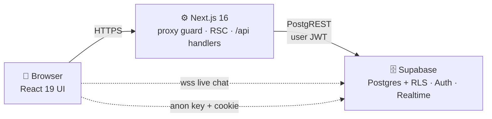

# 🧠 MindCircle

A safe, anonymous mental-wellness companion for students and young professionals. Journal your thoughts, track your mood, connect with peers in community rooms, and find professional help — all in one warm, private space.

> **Built with privacy at the core:** every personal entry is owner-only at the database level, and community features default to anonymous aliases like `quiet-sparrow-42`.

---

## ✨ Features

| Feature | What it does |
|---|---|
| 📓 **Private Journaling** | Write entries with optional mood tags. Owner-only access enforced by Row Level Security. |
| 📈 **Mood Tracking** | Emoji-based daily check-ins with insights: averages, distribution, best day, streaks, and trend takeaways. |
| 👥 **Peer Support** | Anonymous chat rooms with live messaging, plus one-to-one DMs with read receipts. Send up to 9 photos per message from the camera or the gallery, and delete your own messages — the row survives as a placeholder, the content is scrubbed. |
| 🌸 **Community Stories** | Share anonymous 24-hour stories and react with likes. |
| 🎯 **Guided Activities** | Breathing exercises, grounding techniques, and mindfulness practices. |
| 🩺 **Counsellor Directory** | Browse counsellor profiles — credentials, specialisations, availability and what a first session looks like. Booking is not live yet; the UI says so rather than pretending. |
| ❤️ **Crisis Support** | One-tap access to 24/7 Indian helplines (iCall, Vandrevala, AASRA) plus an interactive breathing exercise. |
| 👤 **Community Alias** | A unique, randomly generated handle (`silver-otter`) that is your primary identity everywhere — display names can repeat, aliases cannot. Changeable any time, as long as it stays unique. |
| 🔍 **Discover** | Searchable directory of real members, filterable by interest. Connect, cancel a request, or message people you are already connected with. |
| 🛡️ **Safety Tools** | Block someone (they leave your Discover, chats and search entirely) and report them with a reason. Accounts are removed automatically at 20 reports. |
| 🗂️ **4-Step Profile Setup** | One guided flow for name, pronouns, location, bio, avatar, visibility, interests and goals — reachable again any time from Settings. |
| 🔔 **In-App Notifications** | A bell in the top bar: connection requests, gentle reminders, and new resources. Stored in your browser (`localStorage`), never on a server. |
| 🙋 **Help Centre** | Public About, 17-question FAQ and contact-support pages under `/app/help/*`, linked from Settings, the side nav and the legal pages. |

## 🛠 Tech Stack

| Layer | Technology |
|---|---|
| Framework | [Next.js 16](https://nextjs.org) (App Router, React Server Components) |
| UI | [React 19](https://react.dev), [TypeScript 5](https://www.typescriptlang.org) |
| Styling | [Tailwind CSS v4](https://tailwindcss.com) + [shadcn/ui](https://ui.shadcn.com) (base-nova) + [framer-motion](https://www.framer.com/motion/) |
| Icons | [lucide-react](https://lucide.dev) |
| Database & Auth | [Supabase](https://supabase.com) — PostgreSQL, Auth (Google OAuth; email + OTP is built but dormant until SMTP is configured), Realtime, Storage |
| State | React hooks + Route Handlers (no global store needed — `zustand` is installed but unused) |

## 🔌 API Reference

Every route lives in `src/app/api/**/route.ts` and is a Next.js Route Handler.
**All 21 routes require a signed-in session** — each one re-verifies `auth.getUser()`
server-side and answers `401` without one. There is no public, unauthenticated
API surface.

| Method | Path | What it does |
|---|---|---|
| `GET` | `/api/me` | Auth identity + profile row |
| `PATCH` | `/api/me` | Update profile: `display_name`, `alias`, `pronouns`, `location`, `bio`, `interests`, `goals`, `avatar_emoji`, `is_public`, `share_moods`, `settings`, `onboarded_at` |
| `GET` | `/api/me/alias?alias=` | Live alias availability check (Edit Profile) |
| `POST` | `/api/profile/ensure` | Idempotently provisions the `users` row. Called after every sign-in |
| `GET` | `/api/profiles?q=&limit=` | Discover directory — search + interest filter |
| `GET` | `/api/profile/[id]` | One profile. Redacted to alias + avatar when private and not connected |
| `GET` | `/api/profile/[id]/mood?range=` | Mood trends for a connection who opted in. Aggregates only |
| `GET` `POST` | `/api/mood` | Own mood check-ins — list and create |
| `GET` `POST` `DELETE` | `/api/journal` | Own journal entries — list, create, delete one (`?id=`) |
| `GET` | `/api/journal/[id]` | One journal entry. Someone else's id is a `404` on purpose, so ids cannot be probed |
| `GET` | `/api/connections` | Connections and pending requests, both directions |
| `POST` | `/api/connections` | Send a request (auto-accepts if they asked first) |
| `PATCH` | `/api/connections` | Accept an incoming request |
| `DELETE` | `/api/connections` | Withdraw a request, or remove a connection |
| `GET` `POST` `DELETE` | `/api/blocks` | List, block, unblock. Blocking also drops the connection |
| `GET` `POST` | `/api/reports` | List own reports, report a member (once per person) |
| `GET` `POST` `DELETE` | `/api/chat` | Rooms and membership — list, join, leave |
| `GET` `POST` `DELETE` | `/api/chat/messages?room_id=` | Room messages — history, send (text or up to 9 images), delete your own (`?id=`) |
| `GET` `POST` `DELETE` | `/api/chat/dm` | Direct-message threads — list, open/send, delete your own message (`?id=`) |
| `GET` `POST` `DELETE` | `/api/stories` | 24-hour anonymous stories — feed, create, delete |
| `POST` | `/api/stories/like` | Like or unlike a story |
| `GET` `POST` | `/api/matches` | Suggested people from onboarding interests/goals |
| `POST` | `/api/auth/update-name` | Auth metadata display name |
| `POST` | `/api/auth/change-password` | Change password (requires the current one) |
| `POST` | `/api/auth/google/exchange` | Server-side: redeem Google's `?code=` **and the PKCE verifier** for an `id_token`. The client secret never leaves the server |

**Conventions worth knowing before you add an endpoint:**

- Validation lives in [`src/lib/security.ts`](src/lib/security.ts) — `asUuid`, `asEmail`, `asText`, `asEnum`, `asInt` — and every failure returns a fixed message rather than a database error string.
- **`profile/[id]` returns `200` with a partial body** for a private profile you are not connected with (`locked: true`). A real `404` means the person does not exist, or you blocked them.
- Rate limits: change-password 5 per 5 min, story likes 60 per min.
- Deleting a message is **sender-only and soft** — `DELETE` on both chat routes runs through `deleteMessage()` in [`src/lib/chat/delete.ts`](src/lib/chat/delete.ts), which blanks `content`/`media_paths` and sets `is_deleted` rather than removing the row, so the thread keeps its shape. Someone else's id is a `404`, not a silent success.
- One message carries at most **9 images** (`MAX_IMAGES_PER_MESSAGE` in [`src/lib/chat/limits.ts`](src/lib/chat/limits.ts), kept in sync with the check constraint in migration `009`).
- Input is never trusted — path ids go through `asUuid`, and enum-shaped values (`avatar_emoji`, `pronouns`, `message_type`) are validated against a fixed list before they can be written.

---

## 📁 Project Structure

```
src/
├── app/
│   ├── (auth)/               # Landing, login, signup, OTP verify, onboarding
│   ├── auth/                 # Callbacks: /callback, /confirm, /google/callback
│   ├── blog/                 # Public guides: index + /blog/[slug] articles
│   ├── terms/ privacy/       # Legal pages
│   ├── guides-sitemap.xml/   # Route handler: guides-only sitemap
│   ├── sitemap.ts robots.ts  # Generated from PUBLIC_ROUTES in lib/seo.ts
│   ├── app/                  # Authenticated area (guarded by proxy)
│   │   ├── page.tsx          # Dashboard: mood check-in, weekly stats
│   │   ├── journal/          # Private journaling (+ /journal/[id])
│   │   ├── connect/          # People + rooms discovery
│   │   ├── discover/         # Searchable member directory
│   │   ├── chats/            # Thread inbox; /chats/new starts a DM
│   │   ├── chat/[id]/        # Room & DM thread (realtime, images, delete)
│   │   ├── assessment/       # Guided assessment that writes a mood check-in
│   │   ├── profile/[id]/     # Profile, /about and /mood for a connection
│   │   ├── insights/         # Mood analytics & trends
│   │   ├── activities/       # Guided exercises (+ /activities/[id])
│   │   ├── counsellors/      # Directory (+ /counsellor/[id])
│   │   ├── crisis/           # Helplines + breathing exercise
│   │   ├── help/             # About, FAQ, contact support (public)
│   │   ├── story/create/     # Anonymous stories
│   │   └── settings/         # Account, privacy, edit profile, change password
│   └── api/                  # Route handlers (all auth-checked)
│       ├── me/ (+ /alias)    # Profile read/write, alias availability
│       ├── profile/          # ensure/, [id]/, [id]/mood/
│       ├── profiles/         # Discover directory & search
│       ├── connections/      # Connect / accept / withdraw / remove
│       ├── blocks/ reports/  # Block, unblock, report a member
│       ├── mood/ journal/ (+ [id]) matches/
│       ├── stories/ (+ /like)
│       ├── chat/             # rooms, messages, dms
│       └── auth/             # update-name, change-password, google/exchange
├── components/
│   ├── layout/               # AppLayout, SideNav, BottomNav, TopBar, notification bell
│   ├── chat/                 # AttachmentPreview, MessageMenu
│   ├── auth/ common/ seo/    # Auth art, skeletons, cookie notice, <StructuredData/>
│   └── ui/                   # Button, Card, Modal, EmojiSlider, MoodCheckin…
├── lib/
│   ├── supabase/             # server.ts / client.ts / middleware.ts
│   ├── security.ts           # asUuid / asEmail / asEnum… validators + rateLimit()
│   ├── auth/                 # google-oauth.ts — the direct-Google flow
│   ├── chat/                 # delete.ts / limits.ts / media.ts
│   ├── auth-availability.ts  # Whether email+password sign-in is offered (it is not)
│   ├── auth-errors.ts        # authErrorMessage() — fixed copy, no account enumeration
│   ├── seo.ts                # Site URL, PUBLIC_ROUTES (sitemap source of truth)
│   ├── seo-structured-data.ts# JSON-LD: Organization, WebSite, FAQPage
│   ├── guides.ts             # Blog article content (single source)
│   ├── faq.ts                # 17 FAQs, shared by page + FAQPage schema
│   ├── dates.ts              # Locale-stable formatting (hydration-safe)
│   ├── alias.ts              # Random alias word-list (silver-otter)
│   ├── profile-options.ts    # Interests, goals, avatar choices
│   ├── counsellors.ts        # Static counsellor directory
│   ├── my-requests.ts        # Client-side record of requests you have sent
│   └── constants.ts          # Nav items, mood emojis, features
├── hooks/                    # useMediaQuery
└── proxy.ts                  # Session guard (Next 16 middleware)

supabase/
├── migrations/               # 001…010, run in order (see docs/DATABASE.md)
└── maintenance/              # one-off data fixes, not schema
```

## 🏗 Architecture at a Glance



### Defence in depth

No single check is trusted. A request has to pass **four independent layers**, and the one that matters most is the last one — because it is the only layer an attacker cannot bypass by editing the browser.

| # | Layer | What it stops |
|---|---|---|
| 1 | **Proxy guard** (`src/proxy.ts`) | Unauthenticated browsing. Refreshes the session cookie, bounces guests off `/app/*` and `/onboarding` — except the four public pages in `PUBLIC_APP_PATHS` (`/app/crisis` and the three `/app/help/*` pages), because someone in distress must not be asked to sign in first — and strips cross-origin redirect targets so `?next=` cannot become an open redirect. |
| 2 | **Route handler** (`src/app/api/**`) | Forged requests. Every endpoint re-verifies `auth.getUser()` server-side — a profile id in a URL is guessable, so a client-side gate would stop the tap but not the fetch. |
| 3 | **Input validation** (`src/lib/security.ts`) | Malformed and oversized payloads. UUIDs, emails, enums, text length caps and integer ranges are checked before anything is written, and every error response is a fixed message rather than a database string. |
| 4 | **Row Level Security** (Postgres) | The database itself. RLS decides what a signed-in user can read and write no matter what the application code asks for — this is the layer that holds even if all three above fail. |

**Why the last layer matters most:** the anon key ships in the browser bundle. Anyone can read it and call PostgREST directly, skipping React, the proxy and every route handler entirely. RLS is the only thing standing between that key and the whole database — so all writes are performed *as the signed-in user*, never with a service-role key that would bypass it.

**Additionally rate-limited:** `POST /api/auth/change-password` (5 per 5 minutes — it re-authenticates, so without a throttle it would be a password-guessing oracle) and `POST /api/stories/like` (60 per minute).

**Errors don't leak.** `authErrorMessage()` maps Supabase's raw auth failures to fixed copy, because some of those messages differ depending on whether an account exists — which is account enumeration.

📖 **Full architecture docs:** see [`docs/ARCHITECTURE.md`](docs/ARCHITECTURE.md) — includes system diagrams, signup/data-access/realtime workflows, and the complete ER model. An interactive HTML version lives at `docs/architecture.html`.

🗄 **Database reference:** [`docs/DATABASE.md`](docs/DATABASE.md) — every table grouped by domain, what each column is for, the RLS policy map and the foreign-key layout.

## 🗂 The 4-Step Profile Setup

Right after signup you are taken through one guided flow. It is designed so no step needs scrolling on a laptop or a phone:

1. **Profile details** — display name, pronouns, location, a short bio, and the emoji avatar (no uploads needed). The **visibility** choice lives here too, so it is made in the first step rather than buried in settings:

   | Visibility | Who can see your profile |
   |---|---|
   | 🌐 **Public** | Anyone in Discover can open it. A globe badge marks it. |
   | 🔒 **Private** | Only people you are connected with can open it. Everyone else sees just the alias and avatar, with the rest locked away. |

2. **Interests** — multi-select chips from a fixed list. These power Discover filtering.
3. **Goals** — what you want out of the app; these shape the suggested people on the next step.
4. **You're all set** — a summary of everything you chose (with an edit link back to any step), plus a first batch of suggested matches.

Finishing the flow sets `onboarded_at`. Until that happens the Home screen shows a reminder banner and **Settings → Profile Setup** always lets you reopen and edit any step, including switching visibility later.

Your **alias** (`silver-otter`) is generated by the database on signup and is guaranteed unique — the same handle can never belong to two people. You can change it any time from Edit Profile; availability is checked live as you type.

## 🔑 Google Sign-In

Sign-in works two ways, and the app picks automatically:

- **Supabase-hosted (default).** `supabase.auth.signInWithOAuth({ provider: 'google' })` redirects via `<project>.supabase.co/auth/v1/authorize`. Google's consent screen then reads “to continue to btamknquiykxyjmutoki.supabase.co”. It works out of the box and needs no extra configuration.
- **Direct Google client (optional).** Set `NEXT_PUBLIC_GOOGLE_CLIENT_ID` and the flow switches to [`src/lib/auth/google-oauth.ts`](src/lib/auth/google-oauth.ts): the authorization request goes straight to `accounts.google.com`, so the consent screen names this app's own domain (`mindcircle.vercel.app`). Google returns a `?code=` to `/auth/google/callback`, which posts the code **and the PKCE verifier** to `/api/auth/google/exchange`. That server-side route redeems the code with the client secret and returns only Google's `id_token`; the browser then hands that to Supabase's `signInWithIdToken`, which mints the session. Supabase still issues and validates every JWT, refresh, and `auth.users` row, and **the client secret never leaves the server**.

Setup for the direct flow (Google Cloud Console):

1. Create a project, enable **Google Identity Platform**, then an **OAuth client ID** of type *Web application*.
2. Under *Authorized JavaScript origins*: `https://mindcircle.vercel.app` and `http://localhost:3000` for local work.
3. Under *Authorized redirect URIs*: `https://mindcircle.vercel.app/auth/google/callback` and `http://localhost:3000/auth/google/callback`.
4. Register the same **Client ID** under Supabase → Authentication → Providers → Google (otherwise the `id_token` audience will not match and Supabase rejects it).
5. Put the client id in `.env.local` as `NEXT_PUBLIC_GOOGLE_CLIENT_ID`, the secret as `GOOGLE_CLIENT_SECRET`, and restart the dev server. Both must also be set in the Vercel project environment, not just locally — without them production falls back to the Supabase-hosted flow and Google answers `redirect_uri_mismatch`.

Both values are environment variables only; neither is committed. `.env.local` is gitignored.

The client **secret is required** for this flow, because the code is redeemed server-side at `/api/auth/google/exchange` — that is the whole point of the route, since a browser must never hold a secret. PKCE is still enforced end to end: the verifier is generated before the redirect and checked during the exchange, so a stolen code cannot be redeemed on its own. Only basic profile scopes (`openid email profile`) are requested, so no sensitive-scope verification is triggered. If the variables are absent, sign-in falls back to the Supabase-hosted flow rather than breaking.

---

## 🔒 Privacy & Security Model

### Identity

- **Anonymous by default** — community spaces show your unique alias, never your email. Display names may repeat; aliases cannot: the handle is generated by a database trigger and enforced unique on `lower(alias)`.
- **A private profile reveals only its handle** — a non-connection gets the alias, the avatar, and nothing else. Bio, location, interests, goals and moods are never sent over the wire, so there is nothing to leak client-side. A real 404 is reserved for people you have blocked.

### Consent

- **Visibility is chosen, not defaulted** — new accounts start private, and the choice is made in step 1 of setup rather than buried in settings.
- **Mood data is opt-in twice over** — sharing requires both an accepted connection *and* an explicit **Share mood data** toggle. When it is off, the API returns nothing at all, so there is no empty chart to read anything into.

### User control

- **Blocking is immediate and one-directional** — blocking removes the connection, hides them from Discover and search, and greys out their chats. They are not notified.
- **Reporting has consequences** — every report needs a reason from a closed list and can be filed once per person. At 20 reports a database trigger deletes the account's profile row automatically.
- **Private media buckets** — chat images are never public. They are served only through signed URLs that expire after one hour.
- **Changing your password requires the current one** — the endpoint re-authenticates before updating, so a stolen session cookie alone cannot lock you out.
- **Crisis support is always close** — `/app/crisis` sits in the nav from anywhere, and it is one of the four pages that stays reachable without signing in.

### What the app does *not* claim

Honesty here matters more than a reassuring paragraph:

- **Journal entries are not end-to-end encrypted.** They are protected by RLS and owner-only access, which means the database operator can read them. True E2E encryption is on the roadmap and is the only thing that would change this.
- **Account removal is partial.** The app holds no service-role key, so the 20-report trigger deletes the `public.users` row but not the underlying `auth.users` login. Run a manual purge in the Supabase dashboard to remove the login too.
- **Email sign-in is currently switched off.** Outbound SMTP is not configured yet, so login and signup offer Google only rather than presenting a form that dead-ends on a code that never arrives. The switch lives in [`src/lib/auth-availability.ts`](src/lib/auth-availability.ts).
- **Private profiles are not anonymous accounts.** A private profile is hidden from non-connections, but the platform still holds the email address the account was created with.

## 🔍 SEO

The public, unauthenticated surface is built to be findable:

- **Routes** are registered once in `PUBLIC_ROUTES` in [`src/lib/seo.ts`](src/lib/seo.ts). `sitemap.ts` and `robots.ts` both read from it, so adding a public page is a single-line change. Blog articles are derived automatically from `GUIDES`, so a new article is indexed without touching the route list.
- **Two sitemaps.** `/sitemap.xml` covers everything public; `/guides-sitemap.xml` is a guides-only file served from a route handler, because Search Console had no way to force a re-read of the main sitemap and would otherwise keep reporting a stale page count.
- **Structured data** — `Organization`, `WebSite`, `WebApplication` and `FAQPage` JSON-LD at the site level, and `Article` on each blog post. All generated by [`src/lib/seo-structured-data.ts`](src/lib/seo-structured-data.ts) and rendered by `<StructuredData />`.
- **`lastmod` is day-granular.** An always-changing timestamp makes Google re-crawl a file that has not actually changed, and it eventually stops trusting it.
- **Site verification** uses `NEXT_PUBLIC_GOOGLE_SITE_VERIFICATION`, emitted as a `verification.google` meta tag in [`src/app/layout.tsx`](src/app/layout.tsx). Set it in the Vercel environment for production.
- **Editorial rules** for anything added to `GUIDES`: describe only what the app actually does, make no clinical claims, and point anything about self-harm at `/app/crisis` rather than trying to substitute for it.

Ranking itself is not something the app can control — it depends on content volume and real external links. Search Console's Performance tab is where that shows up, and it stays empty for weeks on a new domain.

---

## 🗺 Roadmap Ideas

- [ ] End-to-end encryption for journal entries
- [ ] More guides, and internal links from the help pages into them
- [ ] AI-assisted mood pattern summaries
- [ ] Counsellor booking & video sessions
- [ ] Push notifications for streaks & check-in reminders
- [ ] Group moderation tools for community rooms
- [ ] A scheduled job that purges deactivated `auth.users` rows
- [ ] Search by location, so you can find people near you

## 🤝 Contributing

1. Create a branch for your change
2. Make your edits — run `npm run lint` and `npx tsc --noEmit` before submitting
3. Keep new UI mobile-first; the app is designed phone-first and scales up to desktop

## 📄 License

Private project — all rights reserved.

---

<p align="center"><em>Made with care for mental wellness. You're not alone. 💜</em></p>
