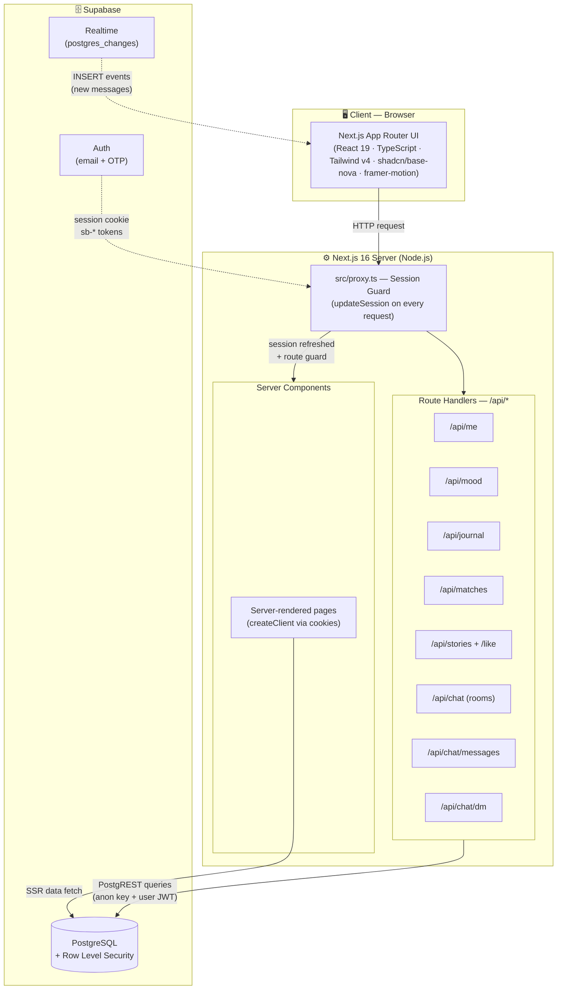
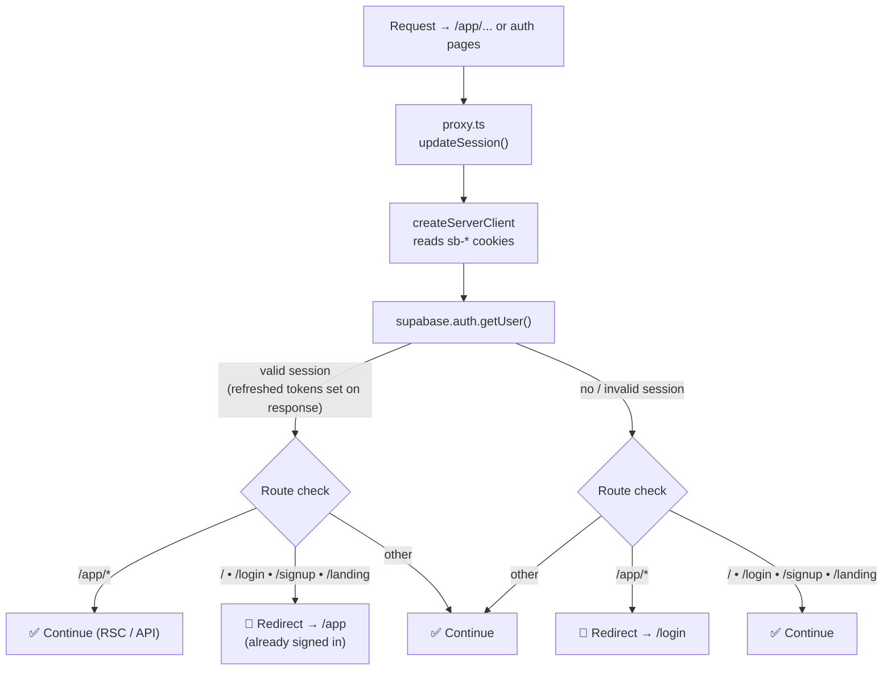
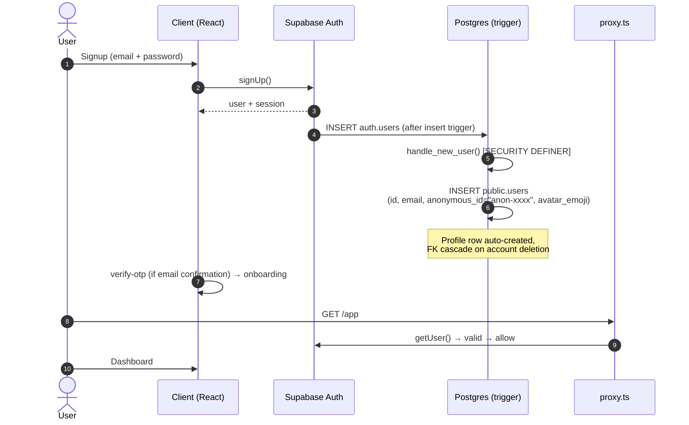
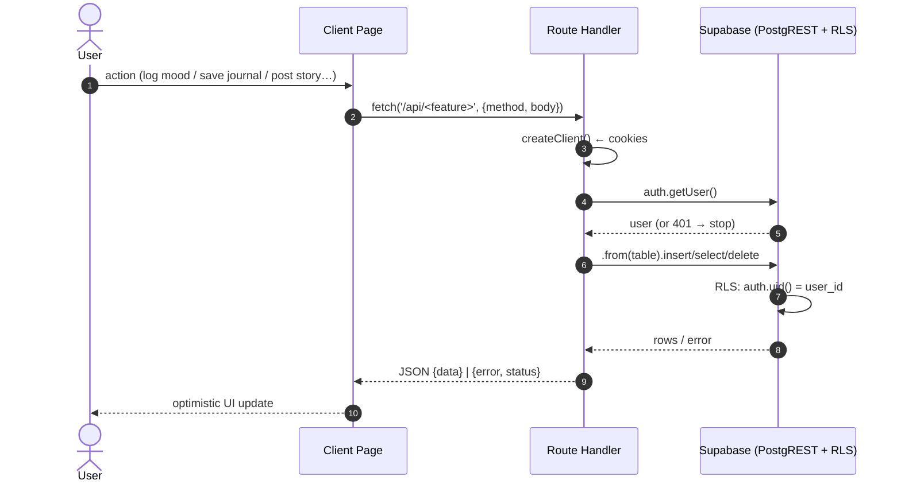
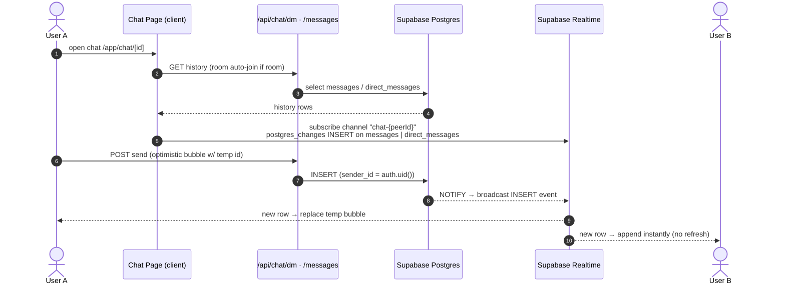
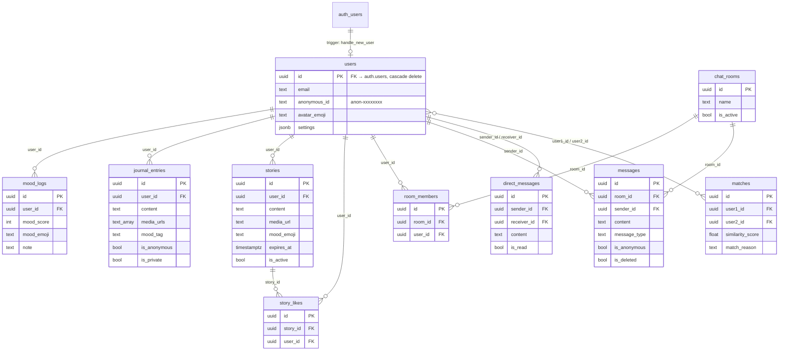
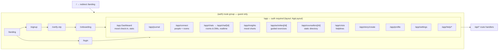
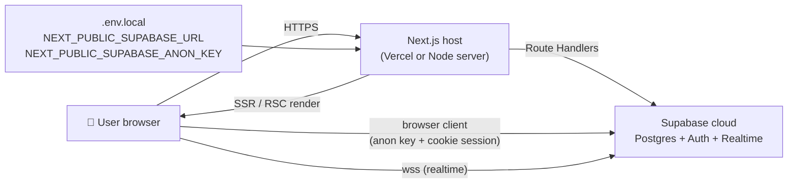

# MindCircle — Solution Architecture & Workflows

> All diagrams are [Mermaid](https://mermaid.js.org). They render natively on GitHub and in most Markdown viewers.

## 1. High-Level System Architecture

### Layers

| Layer | Technology | Responsibility |
|---|---|---|
| Presentation | Next.js 16 App Router, React 19, Tailwind v4, shadcn/ui (base-nova), framer-motion, lucide | Mobile-first UI: dashboard, journal, chats, connect, insights, activities, counsellors, crisis |
| Routing / Guard | `src/proxy.ts` (Next 16 middleware → proxy) | Session refresh via `@supabase/ssr` + redirect logic (guest → `/login`, signed-in → `/app`) |
| API | Route Handlers in `src/app/api/*` | Thin, auth-checked JSON endpoints wrapping Supabase queries |
| Data | Supabase (PostgreSQL + PostgREST) | `users`, `mood_logs`, `journal_entries`, `stories`, `story_likes`, `chat_rooms`, `room_members`, `messages`, `direct_messages`, `matches` |
| Security | RLS policies + Postgres trigger | Owner-only rows; membership-gated chat reads; auto-profile on signup |
| Realtime | Supabase Realtime | Live message INSERTs in the chat page |

---

## 2. Request Lifecycle — Auth Guard (proxy)

Key file: `src/lib/supabase/middleware.ts` — one guard runs for **both** pages and API routes; cookies are refreshed request-scoped.

---

## 3. Authentication & Signup Workflow

**Login path** mirrors it: `signInWithPassword` → session cookie → proxy allows `/app/*`. OTP verification lives in `(auth)/verify-otp`.

---

## 4. Data-Access Workflows (Client → API → Supabase)

All feature writes go through **Route Handlers** (never direct client writes) so every call re-checks `supabase.auth.getUser()` before touching the DB — RLS is the second wall.

### Endpoint → Table Map

| Route | Methods | Table(s) | Notes |
|---|---|---|---|
| `/api/me` | GET, PATCH | `users` | Profile + settings blob (jsonb) |
| `/api/mood` | GET, POST | `mood_logs` | Owner-only (RLS) |
| `/api/journal` | GET, POST, DELETE | `journal_entries` | Owner-only; delete scoped `user_id` |
| `/api/matches` | GET, POST | `matches` | Peer-match rows, scored ordering |
| `/api/stories` | GET, POST, DELETE | `stories` | 24h feed: `expires_at` filter, like counts joined in |
| `/api/stories/like` | POST | `story_likes` | Toggle like + re-count |
| `/api/chat` | GET, POST, DELETE | `chat_rooms`, `room_members` | Rooms list w/ member count, join/leave |
| `/api/chat/messages` | GET, POST | `room_members`, `messages` | **Auto-join room** then read (RLS requires membership) |
| `/api/chat/dm` | GET, POST | `direct_messages`, `users` | Thread grouping, unread counts, dead-peer checks |

---

## 5. Realtime Chat Workflow (rooms + DMs)

---

## 6. Data Model (Supabase Postgres)

### Security Model (RLS summary)

| Table | Policy essence |
|---|---|
| `mood_logs`, `journal_entries` | Owner-only CRUD (`auth.uid() = user_id`) |
| `stories` | Public read (authenticated), owner insert/delete |
| `story_likes` | Public read, owner insert/delete, `unique(story_id, user_id)` |
| `chat_rooms` | Authenticated read |
| `room_members` | Own memberships only |
| `messages` | **Membership-gated**: select/insert requires a `room_members` row |
| `direct_messages` | Participant-only (sender/receiver = auth.uid) |
| `users` | No INSERT policy — populated by `SECURITY DEFINER` trigger on signup |

---

## 7. Page / Route Structure

Navigation adapts to device: `BottomNav` (mobile), `SideNav` (desktop), via `useMediaQuery`.

---

## 8. Deployment & Runtime Topology

- Everything user-facing uses the **anon key + RLS** — no service-role key in the web app.
- Migrations live in [`supabase/migrations/`](../supabase/migrations) and run manually in the Supabase SQL Editor in numeric order; each one is idempotent. One-off data repairs are kept separately in [`supabase/maintenance/`](../supabase/maintenance) because they are not part of the schema. See [`docs/DATABASE.md`](DATABASE.md) for the table reference.
- Counsellor directory is **static** (`src/lib/counsellors.ts`) — no DB table yet.
