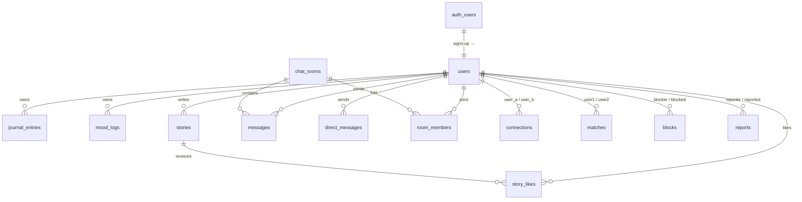

# Database Structure

Reference for the Supabase (PostgreSQL) schema behind MindCircle. Everything
here was read back from the live project, so it describes what actually runs —
not what a migration intended to create.

- **Project:** `btamknquiykxyjmutoki`
- **Schema:** `public` (plus one private Storage bucket, `chat-media`)
- **Auth:** managed by Supabase — the app never stores passwords; `public.users.id`
  *is* the `auth.users.id` (foreign key)

---

## How the tables are organised

The schema splits into five domains. This grouping is the reason migrations are
numbered the way they are: each file adds one thing, in dependency order.

| Domain | Tables | Purpose |
|---|---|---|
| **Identity** | `users` | One row per person. Everything else hangs off this id. |
| **Private data** | `journal_entries`, `mood_logs` | Owner-only. Never exposed to another user without an explicit opt-in. |
| **Social graph** | `connections`, `matches`, `blocks`, `reports` | Who knows whom, and who wants them gone. |
| **Community** | `chat_rooms`, `room_members`, `messages`, `direct_messages`, `stories`, `story_likes`, `counsellors` | The public-facing surfaces. |
| **Infrastructure** | `keep_alive` | Unused placeholder kept by the Supabase platform. Not app logic. |

---

## 1. Identity

### `users`

The single anchor table. Created by Supabase's signup trigger, then extended by
migrations 003–008.

| Column | Type | Notes |
|---|---|---|
| `id` | `uuid` | PK, references `auth.users(id)` |
| `email` | `varchar` | Never shown to another user |
| `alias` | `text` | Community handle (`silver-otter`), unique on `lower(alias)` |
| `display_name` | `text` | Shown on profile; may repeat between people |
| `pronouns` | `text` | Free text; the API only accepts the `PRONOUNS` list |
| `avatar_emoji` | `varchar` | One of the built-in avatars |
| `location`, `bio`, `note` | `text` | Optional profile fields |
| `interests`, `goals`, `personality` | `text[]` | Labels, not FKs — chosen from fixed lists |
| `is_public` | `boolean` | `false` by default. Private ⇒ discoverable only by connections |
| `share_moods` | `boolean` | Opt-in for mood trends. Requires a connection *and* this flag |
| `onboarded_at` | `timestamptz` | Null until the 4-step setup is finished |
| `anonymous_id`, `age_group`, `phone`, `preferences`, `settings`, `last_active`, `is_online`, `created_at` | | Platform/legacy columns; `settings` still backs notification toggles |

**Generated by a trigger, not the app:** `handle_new_user()` inserts the row on
`auth.users` signup and assigns a unique alias. Without it, `/api/me` 500s and
onboarding never appears — see migration `003`.

---

## 2. Private data

### `journal_entries`
`id, user_id, content, media_urls[], mood_tag, is_anonymous, is_private, created_at, updated_at`

Owner-only. `is_private` / `is_anonymous` are display intent for the future
sharing feature; RLS already restricts reads to the owner today.

### `mood_logs`
`id, user_id, mood_score (1–10), mood_emoji, note, weather, temperature, location_city, sleep_hours, activities[], created_at`

Owner-only **unless** the owner sets `users.share_moods` *and* the viewer holds
an accepted connection — the aggregate endpoint returns only grouped values, never
the raw notes.

---

## 3. Social graph

| Table | Columns | Notes |
|---|---|---|
| `connections` | `user_a, user_b, status, created_at, accepted_at` | Canonical pair (`user_a < user_b`). Status: `pending` / `accepted`. 4 policies |
| `matches` | `user1_id, user2_id, similarity_score, match_reason, is_connected` | Suggestion pairs from onboarding. Not a relationship |
| `blocks` | `blocker_id, blocked_id, created_at` | One-directional. Also removes the connection |
| `reports` | `reporter_id, reported_id, reason, details, created_at` | Unique per (reporter, reported). At 20 reports a trigger deletes the reported `users` row |

---

## 4. Community

| Table | Columns | Notes |
|---|---|---|
| `chat_rooms` | `id, name, topic, description, icon, max_members, is_active, created_at` | Seeded sample rooms |
| `room_members` | `id, room_id, user_id, joined_at` | Membership is what makes a message readable (RLS) |
| `messages` | `id, room_id, sender_id, content, message_type, is_anonymous, is_deleted, media_url, created_at` | Room messages; `media_url` points into the private bucket |
| `direct_messages` | `id, sender_id, receiver_id, content, is_read, media_url, created_at` | 1:1 threads |
| `stories` | `id, user_id, content, media_url, mood_emoji, reactions, expires_at, is_active, created_at` | 24-hour, anonymous |
| `story_likes` | `id, story_id, user_id, created_at` | One like per person per story |
| `counsellors` | `id, name, speciality, qualifications, experience_years, rating, consultation_fee, is_verified, is_available, created_at` | Read-only directory |

**Storage:** the `chat-media` bucket is **private** (`public = false`). Images are
only ever served through signed URLs that expire after one hour, and storage
policies restrict inserts to the sender of the message.

---

## 5. Infrastructure

`keep_alive` — single-column scaffold table created by the platform. No code
reads or writes it; listed here only so it is not mistaken for a forgotten table.

---

## Row Level Security

All 15 tables have RLS **enabled**, which is the layer that actually protects
the data. The anon key ships in the browser bundle, so any check that lives only
in React or in a route handler can be skipped by calling PostgREST directly.

| Table | Policies | Shape of the rule |
|---|---|---|
| `users` | 5 | Own row writable; other rows readable only where needed for the directory |
| `journal_entries` | 5 | Owner select / insert / delete |
| `mood_logs` | 5 | Owner select / insert / delete (+ the opt-in share read) |
| `messages` | 5 | Room members only |
| `direct_messages` | 4 | Sender or receiver only |
| `connections` | 4 | Either party only |
| `blocks` | 3 | Blocker only |
| `reports` | 2 | Reporter only |
| `room_members` | 3 | Own membership |
| `stories`, `story_likes` | 6 / 3 | Active stories, own likes |
| `chat_rooms`, `counsellors`, `keep_alive` | 2 / 1 / 1 | Public read |

---

## Referential integrity

There are **20 foreign keys**, and the schema is fully wired — this is the one
part that was already tidy:

- `users.id → auth.users.id` (1)
- every `*_id` pointing at a person → `users` (13): `journal_entries.user_id`,
  `mood_logs.user_id`, `messages.sender_id`, `direct_messages.sender_id` /
  `receiver_id`, `connections.user_a` / `user_b`, `matches.user1_id` / `user2_id`,
  `blocks.blocker_id` / `blocked_id`, `reports.reporter_id` / `reported_id`,
  `room_members.user_id`, `stories.user_id`, `story_likes.user_id`
- `messages.room_id` and `room_members.room_id` → `chat_rooms` (2)
- `story_likes.story_id` → `stories` (1)

So an orphaned chat or journal row cannot be written. That is why the
[orphan DM cleanup](../supabase/maintenance/999_orphan_dm_cleanup.sql) script
needed to exist — it repairs damage from *before* those keys were added.

---

## Entity relationships



---

## Migrations

```
supabase/
├── migrations/     # run in numeric order, idempotent, safe to re-run
│   ├── 001_core_auth.sql
│   ├── 002_rls_and_content.sql
│   ├── 003_users_write_and_trigger.sql
│   ├── 004_profiles_and_connections.sql
│   ├── 005_profile_about_fields.sql
│   ├── 006_safety_blocks_and_reports.sql
│   ├── 007_chat_media_and_mood_sharing.sql
│   └── 008_pronouns.sql
└── maintenance/    # one-off data fixes, NOT part of the schema
    └── 999_orphan_dm_cleanup.sql
```

**003 is the one people miss.** Without it the `users` row for a brand-new
account is never created, so `/api/me` returns 500 and the profile-setup flow
never appears.

## Known gaps

- **`users` is a grab-bag.** Its 20 columns mix identity (`alias`, `display_name`,
  `pronouns`), profile (`bio`, `location`, `note`, `personality`), preferences
  (`interests`, `goals`), privacy flags (`is_public`, `share_moods`) and platform
  leftovers (`preferences`, `settings`, `phone`, `is_online`). It works, but every
  new column lands in one table. `personality` and `note` in particular belong
  with the profile rather than beside the auth identity.
- **No `ON DELETE CASCADE` from `auth.users`.** Deleting an auth account does not
  automatically clear the profile row and its dependents; that is done
  application-side, and the reason the cleanup script exists.
- **`counsellors` has no `user_id`** — it is a static directory, not user data.
- **Auto-removal stops at `public.users`.** With no service-role key, the
  20-report trigger cannot delete the underlying `auth.users` login.
- **`keep_alive` is dead weight** from the platform scaffold.